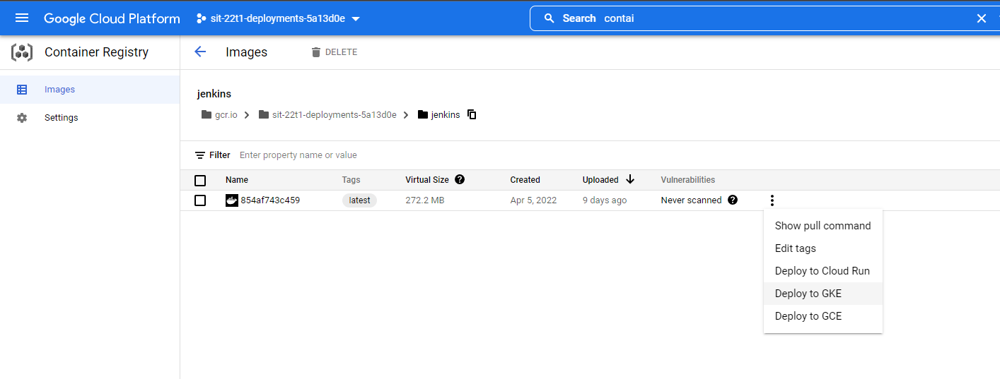
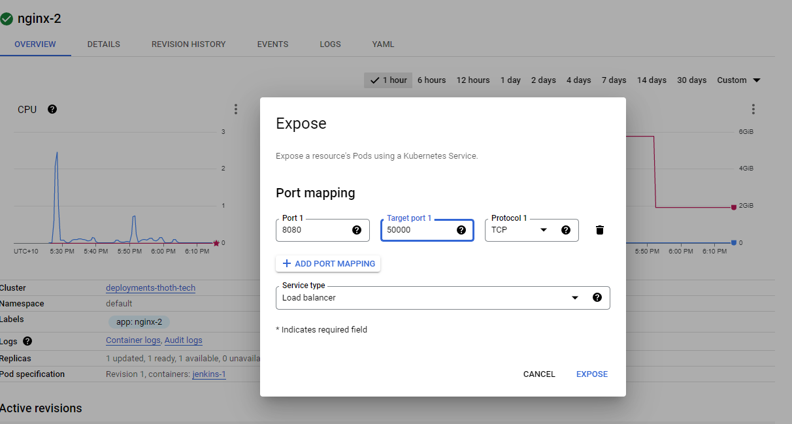
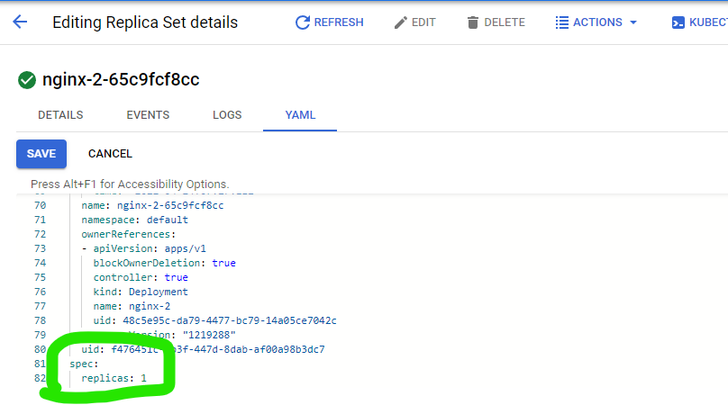
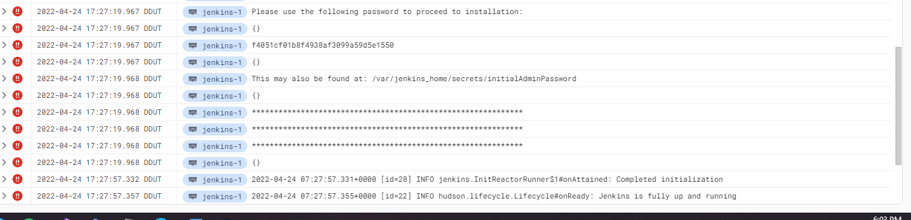

# How to host Jenkins on GCP

Hosting Jenkins on GCP is relavtively easy, its just an extension of running it locally through docker. I've decided to use Google Kubernetes Engine (GKE) as I was having some auth issues with Cloud run

Prerequisites

- [GCLOUD CLI](https://cloud.google.com/sdk/docs/install)
- [Docker](https://docs.docker.com/get-docker/)
- GCP account provisioned by Deakin
- Have the image you want to push already configured

Steps to host on GCP

1. Push your desired image to a repository (GCP). See below for instructions
2. Create a Kubernetes Cluster using GKE. I have attached a great [guide](./gke_guide.pdf).
3. Go to container registry within GCP and click. 'Deploy to GKE'. Image attached below.

4. Configure the port forwarding by going to the workload and going to actions and in the drop down clicking expose. I believe you have to have the same configuration of ports as in the screenshot.

5. Set the replica count in the YAML of the workload to 1

6. If you have not set up Jenkins before now, you'll need to grab the temporary password in the logs.

**How to push a docker image to a repository (GCP)**

It is a good idea to have the Docker GUI open aswell, it'll help with retrieving details you'll need. I'm going to push our image to the GCP Container registry.

1. Login to GCLOUD by running `gcloud auth login`
2. Go to the [cloud console](https://console.cloud.google.com/) and find your project id, it's in the top left.
3. Run `gcloud config set project YOUR_PROJECT` Replace YOUR_PROJECT with your project id.
4. Tag your image with the your project id and the name you want to give it. For example I have an image `jenkins/jenkins` that I want to push. I would run `docker tag jenkins/jenkins gcr.io/YOUR_PROJECT/jenkins` You can also see this new image appear in your docker GUI 
5. Push the image using `docker push gcr.io/YOUR_PROJECT/jenkins`